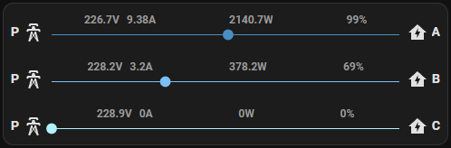

# Energy Overview Card by [@Sese-Schneider](https://www.github.com/Sese-Schneider)

A simple card which displays energy usage details of one or multiple entities.

[](https://my.home-assistant.io/redirect/hacs_repository/?owner=Sese-Schneider&repository=ha-energy-overview-card&category=frontend)
[![GitHub Release][releases-shield]][releases]
![GitHub Downloads][downloads-shield]

[![License][license-shield]](LICENSE)
![Project Maintenance][maintenance-shield]
[![GitHub Activity][commits-shield]][commits]

[](https://buymeacoffee.com/seseschneider)

**Features:**

- Variable amount of monitoring entities
- Voltage, Current, Power, Frequency and Power Factor display
- Automatic unit of measurement detection
- Adjustable colors, labels and icons
- Configurable dynamic animations adapting to power usage

*Three-phase power monitoring example:*



## Options

| Name      | Type               | Requirement  | Description                         | Default |
|-----------|--------------------|--------------|-------------------------------------|---------|
| type      | string             | **Required** | `custom:energy-overview-card`       |         |
| entities  | Array<PowerEntity> | **Required** | List of power entities (see below)  |         |
| animation | AnimationConfig    | *Optional*   | Animation configuration (see below) |         |

#### PowerEntity

| Name           | Type            | Requirement  | Description                        | Default                                |
|----------------|-----------------|--------------|------------------------------------|----------------------------------------|
| power          | state entity    | **Required** | State entity for power             |                                        |
| voltage        | state entity    | *Optional*   | State entity for voltage           |                                        |
| current        | state entity    | *Optional*   | State entity for current           |                                        |
| frequency      | state entity    | *Optional*   | State entity for frequency         |                                        |
| power_factor   | state entity    | *Optional*   | State entity for power_factor      |                                        |
| icon_leading   | string          | *Optional*   | Leading MD icon                    | `mdi:transmission-tower`               |
| icon_trailing  | string          | *Optional*   | Trailing MD icon                   | `mdi:home-lightning-bolt`              |
| label_leading  | string          | *Optional*   | Leading label                      |                                        |
| label_trailing | string          | *Optional*   | Trailing label                     |                                        |
| color          | string          | *Optional*   | CSS color                          | `var(--energy-grid-consumption-color)` |
| animation      | AnimationConfig | *Optional*   | Overwrite for the global animation |                                        |

#### AnimationConfig

| Name         | Type   | Requirement | Description                                                       | Default |
|--------------|--------|-------------|-------------------------------------------------------------------|---------|
| power        | number | *Optional*  | Wattage level at which the animation runs at `min_duration` speed | 1000    |
| min_duration | number | *Optional*  | Minimum duration of the animation at `>= power W`                 | 1       |
| max_duration | number | *Optional*  | Maximum duration of the animation at `> 0 W`                      | 10      |

### Example configuration

```yaml
type: custom:energy-overview-card
entities:
  - power: sensor.a_p
    current: sensor.a_c
    voltage: sensor.a_v
    power_factor: sensor.a_pf
    label_leading: 'P'
    label_trailing: 'L1'
    icon_leading: 'mdi:transmission-tower'
    icon_trailing: 'mdi:home-lightning-bolt'
    color: '#488fc2'
  - power: sensor.b_p
    current: sensor.b_c
    voltage: sensor.b_v
    power_factor: sensor.b_pf
    label_leading: 'P'
    label_trailing: 'L2'
    color: '#7dbff5'
    animation:
      power: 100
      min_duration: 2
      max_duration: 5
  - power: sensor.c_p
    current: sensor.c_c
    voltage: sensor.c_v
    frequency: sensor.c_fq
    power_factor: sensor.c_pf
    label_leading: 'P'
    label_trailing: 'L3'
    color: '#b1f2ff'
animation:
  power: 1000
  min_duration: 1
  max_duration: 10
```

## Install

### HACS

*This repo is available for install through the HACS.*

* Go to HACS → Frontend
* Use the FAB "Explore and download repositories" to search "Energy Overview Card".

_or_

Click here:

[](https://my.home-assistant.io/redirect/hacs_repository/?owner=Sese-Schneider&repository=ha-energy-overview-card&category=frontend)


### Simple install

* Download and copy `energy-overview-card.js` from the
  latest [release](https://github.com/Sese-Schneider/ha-energy-overview-card/releases/latest) into your `config/www`
  directory.
* Add a reference to `energy-overview-card.js` as JavaScript-Module to your Lovelace dashboard via "Manage Resources". (
  Note: You have to enable advanced mode)


[Troubleshooting](https://github.com/thomasloven/hass-config/wiki/Lovelace-Plugins)


[commits-shield]: https://img.shields.io/github/commit-activity/y/Sese-Schneider/ha-energy-overview-card.svg?style=for-the-badge

[downloads-shield]: https://img.shields.io/github/downloads/Sese-Schneider/ha-energy-overview-card/total.svg?style=for-the-badge

[commits]: https://github.com/Sese-Schneider/ha-energy-overview-card/commits/main

[license-shield]: https://img.shields.io/github/license/Sese-Schneider/ha-energy-overview-card.svg?style=for-the-badge

[maintenance-shield]: https://img.shields.io/maintenance/yes/2023.svg?style=for-the-badge

[releases-shield]: https://img.shields.io/github/release/Sese-Schneider/ha-energy-overview-card.svg?style=for-the-badge

[releases]: https://github.com/Sese-Schneider/ha-energy-overview-card/releases
