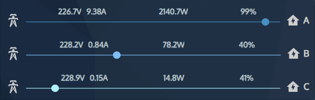

# Energy Overview Card by [@Sese-Schneider](https://www.github.com/Sese-Schneider)

A simple card that shows your current energy usage.

[](https://github.com/hacs/integration)
[![GitHub Release][releases-shield]][releases]
[![License][license-shield]](LICENSE.md)

![Project Maintenance][maintenance-shield]
[![GitHub Activity][commits-shield]][commits]

[![Discord][discord-shield]][discord]
[![Community Forum][forum-shield]][forum]



## Options

| Name           | Type   | Requirement  | Description                   | Default |
|----------------|--------|--------------|-------------------------------|---------|
| type           | string | **Required** | `custom:energy-overview-card` |         |
| a_current      | string | **Required** | `Phase A current entity`      |         |
| a_voltage      | string | **Required** | `Phase A voltage entity`      |         |
| a_power        | string | **Required** | `Phase A power entity`        |         |
| a_power_factor | string | **Required** | `Phase A power factor entity` |         |
| b_current      | string | **Required** | `Phase B current entity`      |         |
| b_voltage      | string | **Required** | `Phase B voltage entity`      |         |
| b_power        | string | **Required** | `Phase B power entity`        |         |
| b_power_factor | string | **Required** | `Phase B power factor entity` |         |
| c_current      | string | **Required** | `Phase C current entity`      |         |
| c_voltage      | string | **Required** | `Phase C voltage entity`      |         |
| c_power        | string | **Required** | `Phase C power entity`        |         |
| c_power_factor | string | **Required** | `Phase C power factor entity` |         |

## Install

*This repo can be installed as a custom repository in HACS*

### Simple install

1. Download and copy `energy-overview-card.js` from the [dist](https://github.com/Sese-Schneider/ha-energy-overview-card/dist) into your `config/www` directory.

2. Add a reference to `energy-overview-card.js` inside your `ui-lovelace.yaml`.

  ```yaml
  resources:
    - url: /local/energy-overview-card.js
      type: module
  ```

[Troubleshooting](https://github.com/thomasloven/hass-config/wiki/Lovelace-Plugins)

[commits-shield]: https://img.shields.io/github/commit-activity/y/Sese-Schneider/ha-energy-overview-card.svg?style=for-the-badge
[commits]: https://github.com/Sese-Schneider/ha-energy-overview-card/commits/master
[discord]: https://discord.gg/5e9yvq
[discord-shield]: https://img.shields.io/discord/330944238910963714.svg?style=for-the-badge
[forum-shield]: https://img.shields.io/badge/community-forum-brightgreen.svg?style=for-the-badge
[forum]: https://community.home-assistant.io/c/projects/frontend
[license-shield]: https://img.shields.io/github/license/Sese-Schneider/ha-energy-overview-card.svg?style=for-the-badge
[maintenance-shield]: https://img.shields.io/maintenance/yes/2023.svg?style=for-the-badge
[releases-shield]: https://img.shields.io/github/release/Sese-Schneider/ha-energy-overview-card.svg?style=for-the-badge
[releases]: https://github.com/Sese-Schneider/ha-energy-overview-card/releases
