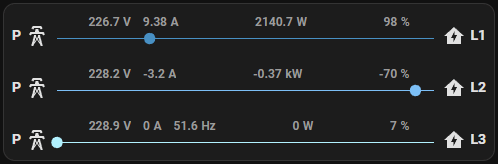

# Energy Overview Card by [@Sese-Schneider](https://www.github.com/Sese-Schneider)

A simple card that shows your current energy usage.

[](https://github.com/hacs/integration)
[![GitHub Release][releases-shield]][releases]
[![License][license-shield]](LICENSE.md)

![Project Maintenance][maintenance-shield]
[![GitHub Activity][commits-shield]][commits]

[](https://buymeacoffee.com/seseschneider)

**Features:**

- Variable amount of monitoring entities
- Voltage, Current, Power, and Power Factor display
- Adjustable colors, labels and icons
- Configurable dynamic animations adapting to power usage

*Three-phase power monitoring example:*



## Options

| Name      | Type               | Requirement  | Description                         | Default |
|-----------|--------------------|--------------|-------------------------------------|---------|
| type      | string             | **Required** | `custom:energy-overview-card`       |         |
| entities  | Array<PowerEntity> | **Required** | List of power entities (see below)  |         |
| animation | AnimationConfig    | *Optional*   | Animation configuration (see below) |         |

#### PowerEntity

| Name           | Type         | Requirement  | Description                   | Default                                |
|----------------|--------------|--------------|-------------------------------|----------------------------------------|
| power          | state entity | **Required** | State entity for power        |                                        |
| current        | state entity | *Optional*   | State entity for current      |                                        |
| voltage        | state entity | *Optional*   | State entity for voltage      |                                        |
| power_factor   | state entity | *Optional*   | State entity for power_factor |                                        |
| label_leading  | string       | *Optional*   | Leading label                 |                                        |
| label_trailing | string       | *Optional*   | Trailing label                |                                        |
| icon_leading   | string       | *Optional*   | Leading MD icon               | `mdi:transmission-tower`               |
| icon_trailing  | string       | *Optional*   | Trailing MD icon              | `mdi:home-lightning-bolt`              |
| color          | string       | *Optional*   | CSS color                     | `var(--energy-grid-consumption-color)` |

#### AnimationConfig

| Name         | Type   | Requirement | Description                                                        | Default |
|--------------|--------|-------------|--------------------------------------------------------------------|---------|
| power        | number | *Optional*  | Wattage level at which the animation runs at `min_duration` speed. | 1000    |
| min_duration | number | *Optional*  | Minimum duration of the animation at `>= power W`                  | 1       |
| max_duration | number | *Optional*  | Maximum duration of the animation at `> 0W`.                       | 10      |

### Example configuration

```yaml
type: custom:energy-overview-card
entities:
  - power: sensor.a_p
    current: sensor.a_c
    voltage: sensor.a_v
    power_factor: sensor.a_pf
    label_leading: P
    label_trailing: A
    color: '#488fc2'
  - power: sensor.b_p
    current: sensor.b_c
    voltage: sensor.b_v
    power_factor: sensor.b_pf
    label_leading: P
    label_trailing: B
    color: '#7dbff5'
  - power: sensor.c_p
    current: sensor.c_c
    voltage: sensor.c_v
    power_factor: sensor.c_pf
    label_leading: P
    label_trailing: C
    color: '#b1f2ff'
animation:
  power: 1000
  min_duration: 1
  max_duration: 10
```

## Install

### HACS

*This repo can be installed as a custom repository in HACS*

- Go to HACS → Frontend
- Click on the three-dot-menu → Custom repositories
- Add `Sese-Schneider/ha-energy-overview-card` as Lovelace
- Use the FAB "Explore and download repositories" to search "Energy Overview Card"

### Simple install

1. Download and copy `energy-overview-card.js` from the
   latest [release](https://github.com/Sese-Schneider/ha-energy-overview-card/releases/latest) into your `config/www`
   directory.

2. Add a reference to `energy-overview-card.js` inside your `ui-lovelace.yaml`.

  ```yaml
  resources:
    - url: /local/energy-overview-card.js
      type: module
  ```

[Troubleshooting](https://github.com/thomasloven/hass-config/wiki/Lovelace-Plugins)

[commits-shield]: https://img.shields.io/github/commit-activity/y/Sese-Schneider/ha-energy-overview-card.svg?style=for-the-badge

[commits]: https://github.com/Sese-Schneider/ha-energy-overview-card/commits/master

[license-shield]: https://img.shields.io/github/license/Sese-Schneider/ha-energy-overview-card.svg?style=for-the-badge

[maintenance-shield]: https://img.shields.io/maintenance/yes/2023.svg?style=for-the-badge

[releases-shield]: https://img.shields.io/github/release/Sese-Schneider/ha-energy-overview-card.svg?style=for-the-badge

[releases]: https://github.com/Sese-Schneider/ha-energy-overview-card/releases
